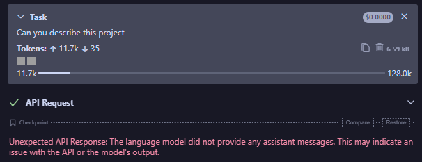
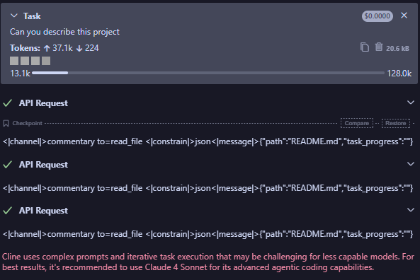
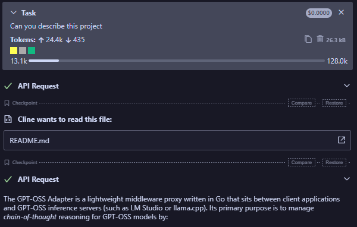
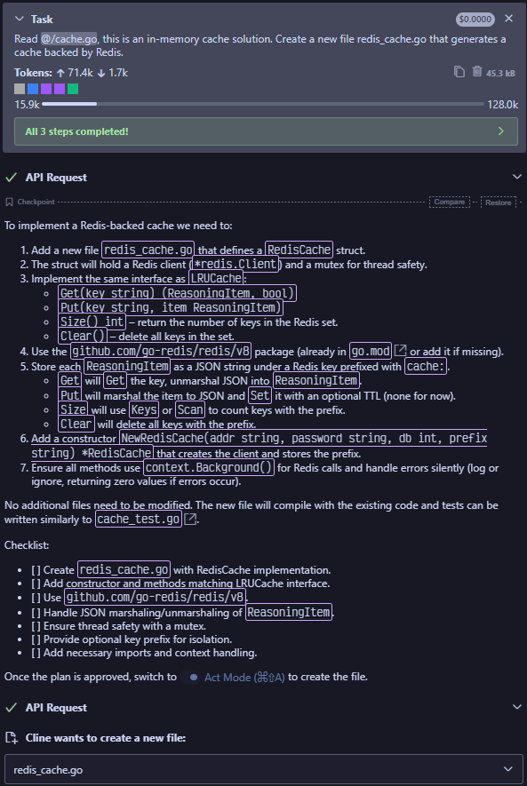
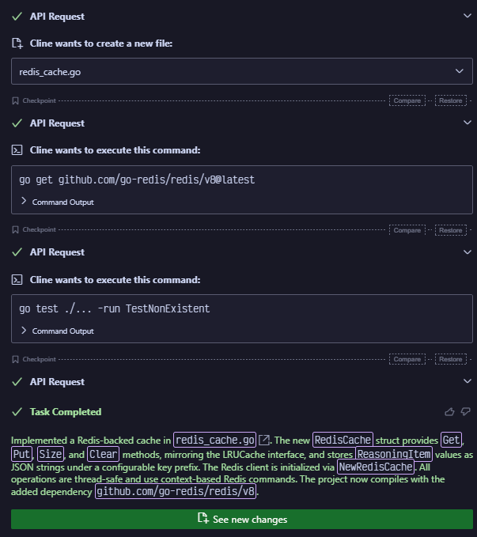

There has been some disappointment surrounding the GPT-OSS 20B model. Most of
this is centered around its inability to use Cline/Roo Code's definition of
tools. In short, GPT-OSS is trained to respond to tools in its own style and
not how either of these tools expects.

I found a workaround that seems to work decently well, at least in the limited
testing I've done. This workaround requires
[llama.cpp](https://github.com/ggml-org/llama.cpp) because we need to use an
advanced feature: grammars. You'll need the latest version to start, as the
harmony parsing was only supported a few days ago.

## The Problem

Here is llama.cpp without a grammar, and LM Studio as a comparison:


**llama.cpp w/o grammar**


**LM Studio**

The outputs are slightly different. llama.cpp does not include
the unparsed output, but LM Studio does. Neither is correct. However, with a
simple grammar file, you can coerce the model to respond properly:


**llama.cpp w/ grammar**

## Instructions

Create a file called `cline.gbnf` and place these contents:

```text
root ::= analysis? start final .+
analysis ::= "<|channel|>analysis<|message|>" ( [^<] | "<" [^|] | "<|" [^e] )* "<|end|>"
start ::= "<|start|>assistant"
final ::= "<|channel|>final<|message|>"
```

When running `llama-server`, pass in `--grammar-file cline.gbnf`, making sure
the path points to the proper file.

## Example

Here is a complete example:





## How does it work?

The grammar forces the model to output to its `final` channel, which is the
output sent to the user. In native tool calls, it generates the output in the
`commentary` channel. So it will never generate a native tool call, and instead
coerces it to produce a message that (hopefully) contains the tool call
notation that Cline expects.
