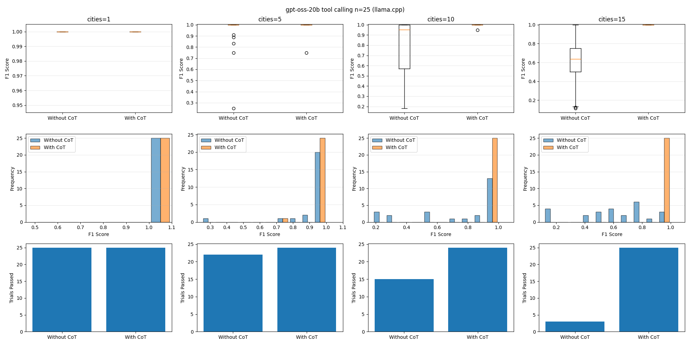

I still see people not properly tool calling[^1] with gpt-oss. I think it's
mostly a lack of awareness and client support.

Unlike other models, gpt-oss requires the chain-of-thought (CoT), aka
reasoning, from past tool calls. This isn't captured in the OpenAI Chat
Completions API, but several providers expose it through one of the following
fields:

- `reasoning` - LM Studio, Ollama, OpenRouter
- `reasoning_content` - llama.cpp

From [How to handle the raw chain of thought in
gpt-oss](https://cookbook.openai.com/articles/gpt-oss/handle-raw-cot), you are
supposed to send this back in subsequent samplings:

> If the last message by the assistant was a tool call of any type, the
> analysis messages until the previous final message should be preserved on
> subsequent sampling until a final message gets issued

Many clients do handle receiving the CoT, usually by outputting it in a
"thinking" block, but I haven't seen one actually send it back in following
requests.

To illustrate how important this is, I created a
[notebook](https://github.com/aldehir/gpt-oss-tool-calling-notebook/blob/main/tool-calling.ipynb)
to run experiments with and without sending back the CoT.

The experiment is simple, but if it fails on a simple task, you can imagine how
it would fare on more complex agentic ones:

1. Give gpt-oss a `get_weather` tool that provides a canned weather response
   for a given city.
2. Ask gpt-oss to obtain the weather for various cities and tabulate the
   results. The number of cities is an adjustable parameter. Note: gpt-oss does
   not support parallel tool calling, so each request only returns one tool
   call.
3. Run in a loop until gpt-oss responds without a tool call or a max of 25
   turns is reached.

Here are the results with llama.cpp and gpt-oss-20b. The F1 score is a function
of precision and recall. A score of 1.0 means perfect precision/recall. In
other words, it performed all necessary tool calls with no failed or redundant
calls. The bottom bar charts show the number of trials that successfully
completed the task. If there is a better metric to use, I am happy to add that
in as well, but I think this does a good job of illustrating the problem.

By increasing the number of cities in the prompt, we increase the number of
turns. Without passing along the CoT, performance starts to degrade the more
turns it takes to complete the task. When passing the CoT, it completes the
task pretty reliably.

How do you pass along the CoT? Well, that depends on the provider.

- llama.cpp - You can pass the `reasoning_content` field back in each tool call
  message made by gpt-oss.
- Ollama/LM Studio - You can try passing back the `reasoning` field, but I am
  not sure if they inject it into their gpt-oss template. LM Studio now
  supports the Responses API, which should support this without any change to
  the client.
- vLLM - If you're using the Respones API, you don't have to do a thing!
  Internally, the Responses endpoint should handle passing along the CoT for
  you.
- OpenRouter - You can pass the `reasoning` field back, but it likely depends
  on the underlying provider.

As for client support, well, that's where things fall apart. From what I can
see, no client supports this. The [OpenAI Agents
SDK](https://github.com/openai/openai-agents-python) added support for a
`reasoning` field, but I don't believe other libraries followed suit. Perhaps
the path of least resistance is to use an inference server with the Responses
API and a client that supports it. This is one of the reasons why people
struggle with tool calling.

[^1]: This pertains to native tool calling, which involves defining tools
in the `tools` field, receiving calls in `tool_calls`, and sending back tool
outputs with the `tool` role. There is a class of clients, such as Cline and
Roo Code, that **do not** use native tool calling. Those issues are mostly
related to their prompting mechanism and gpt-oss's stubbornness.
