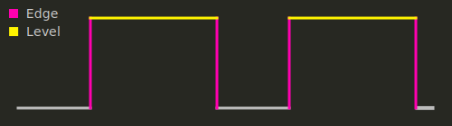
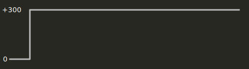
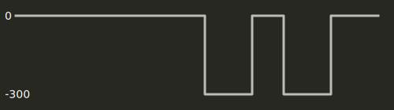
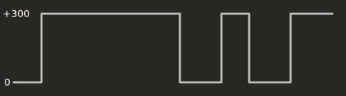
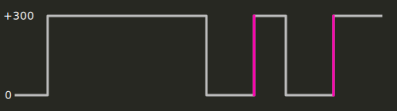

You're in the middle of a fight---dodging rockets, cores, shock combos. In the
chaos you dodge straight into a combo that leads to your death. You swear you
didn't double tap in that direction. "F\*cking auto-dodge," you say in chat
followed by gaslighting from your peers, "I never auto-dodge." Is it just you?
Maybe you did accidentally double tap in the chaos. Well, I'm here to say
you're not crazy. Auto-dodging, or what I prefer to call unintentional dodging,
is a thing in the Unreal Tournament franchise---always has been.

An unintentional dodge is when your character dodges without a distinct double
tap in the dodge direction. You can easily reproduce this with the following
key combination,

```text
Hold Forward,
Double Tap Back
↳ Dodge Forward
```

Or,

```text
Hold Right
Double Tap Left
↳ Dodge Right
```

However, you can't reproduce it if you change the directions! For example,

```text
Hold Backward,
Double Tap Forward
```

Does not lead to a forward dodge. Why? Let's dig into that.


## Axis

Unreal Tournament does not directly translate a key press to a movement action.
Instead, UT maps key presses as a change in an "Axis". Put simply, an Axis is a
1-dimensional unit representing speed. If you look at your `user.ini`, you may
have seen these lines and wondered what they mean:

```ini
Aliases[2]=(Command="Axis aBaseY  Speed=+300.0",Alias="MoveForward")
Aliases[3]=(Command="Axis aBaseY  Speed=-300.0",Alias="MoveBackward")
Aliases[4]=(Command="Axis aBaseX Speed=-40.0",Alias="TurnLeft")
Aliases[5]=(Command="Axis aBaseX  Speed=+40.0",Alias="TurnRight")
Aliases[6]=(Command="Axis aStrafe Speed=-300.0",Alias="StrafeLeft")
Aliases[7]=(Command="Axis aStrafe Speed=+300.0",Alias="StrafeRight")
Aliases[8]=(Command="Jump | Axis aUp Speed=+300.0",Alias="Jump")
Aliases[9]=(Command="Button bDuck | Axis aUp Speed=-300.0",Alias="Duck")
```

The `Move` and `Strafe` aliases modify the `aBaseY` and `aStrafe` axis values,
respectively, to a speed of `± 300.0`.

If you press `W`, bound to `MoveForward`, then `aBaseY = +300.0`. If you press
`S`, then `aBaseY = -300.0`, and if you press both `W` and `S` then `aBaseY =
0.0`---theoretically, more on this later!


## Dodge Detection

UT uses the axis to determine movement direction, and this is where the logic
starts to get faulty. Let's take a look at `PlayerInput.uc` to see how double
taps are detected.

```uc
// Check for Double click move
// flag transitions
bEdgeForward = (bWasForward ^^ (aBaseY > 0));
bEdgeBack = (bWasBack ^^ (aBaseY < 0));
bEdgeLeft = (bWasLeft ^^ (aStrafe < 0));
bEdgeRight = (bWasRight ^^ (aStrafe > 0));
bWasForward = (aBaseY > 0);
bWasBack = (aBaseY < 0);
bWasLeft = (aStrafe < 0);
bWasRight = (aStrafe > 0);
```

Further down these values are used to determine dodge direction,

```uc
if (bEdgeForward && bWasForward)
    DoubleClickDir = DCLICK_Forward;
else if (bEdgeBack && bWasBack)
    DoubleClickDir = DCLICK_Back;
else if (bEdgeLeft && bWasLeft)
    DoubleClickDir = DCLICK_Left;
else if (bEdgeRight && bWasRight)
    DoubleClickDir = DCLICK_Right;
```

The Axis `aBaseY` and `aStrafe` encode movement direction as positive/negative
speeds.

The `bEdge` variables represent an "edge" event. The easiest way to visualize
this is to consider a digital signal graph,



The dodge detection code looks for two edge events that lead to a key
release. This is how it infers a "double tap".


So far everything seems good. Now let's consider the unintentional forward
dodge scenario.

Forward key `(W)`


Backward key `(S)`


Because forward and back keys are aggregated into a single axis, `aBaseY`, the
true result is a combination of these graphs.



What do you notice in this graph? That's right, two dodge triggering forward
edge events! Despite double tapping the back key, `S`, we are propelled
forward due to a bug in the dodge detection algorithm.




## Floating Point Errors

OK, so we know the condition under which an unintentional forward dodge occurs.
But why does this not occur in reverse? If we hold down the back key and double
tap the forward key, why do we not dodge backwards? The reason lies in floating
point arithmetic. It's time to dive into the Unreal Engine code, particularly
the input processing.

Let's start off with the code that processes keyboard input for Axis variables,

```cpp
else if( GetInputAction() == IST_Hold )
{
    *Axis += GetInputDelta() * Speed * Invert;
}
```

Nothing special, it simply adds to the referenced axis variable. In this case,
`GetInputDelta() = DeltaSeconds` and `Invert = 1.0`.

Later on, the Axis value is scaled up before sending it to the UnrealScript
code for further processing.

```cpp
FLOAT Scale = (DeltaSeconds != -1.f) ? (20.f / DeltaSeconds) : 0.f;
```

Put these calculations together and the Axis value on forward key press
becomes,

```cpp
Axis = DeltaSeconds * Speed * 20.0 / DeltaSeconds
     = 300.0 * 20.0
     = 6000.0
```

Seems reasonable. Now how about when both forward and backwards keys are
pressed?

```cpp
// Forward key
Axis = DeltaSeconds * 300.0 * 20.0 / DeltaSeconds

// Backward key
Axis += DeltaSeconds * -300.0 * 20.0 / DeltaSeconds
```

So the end result should be `Axis = 0.0`, right? Turns out, it's not!

Because `DeltaSeconds < 1.0` (`DeltaSeconds = 0.004` at `250` fps), floating
point precision starts rearing its ugly head. These aggregate operations result
in a case where `Axis` is **really** close to `0.0` but not exactly `0.0`.

Perhaps this is why the bug was never noticed at development. With
`DeltaSeconds` having millisecond resolution, pressing both directional keys
yields `-0.0001 < Axis < 0.0`[^1]. So when you press and hold back, then double
tap forward, the dodge detection doesn't detect a change in direction because
the Axis value is always negative!


## Conclusion

Diving into the dodge code was a fun journey. I ended up [patching the axis
code][dodge-patch] in the engine to fix this in my custom UT2004 binary.

My solution took inspiration from the case where an unintentional dodge does
not occur. When both keys are pressed, set the axis to a very small positive or
negative number depending on the last directional key pressed.


[dodge-patch]: https://github.com/aldehir/ut2004-patches/blob/main/0014-Add-a-workaround-for-a-bug-in-dodge-detection.patch

[^1]: This does **not** hold true when `DeltaSeconds` is a higher resolution,
      which I found out real quick in my timer patch for UT2004. At
      higher resolution, `-0.0001 < Axis < +0.0001`, which means it fluctuates
      between `+/-`. This is why I had to add special logic to fix this dodge
      bug in the engine.
